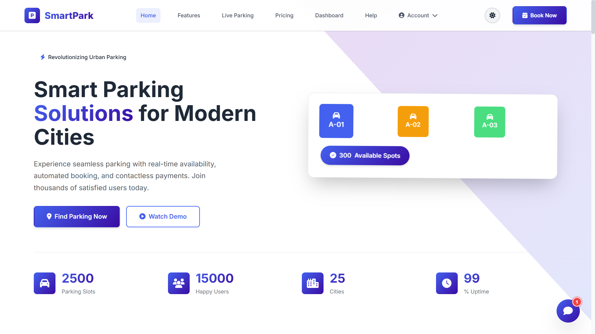
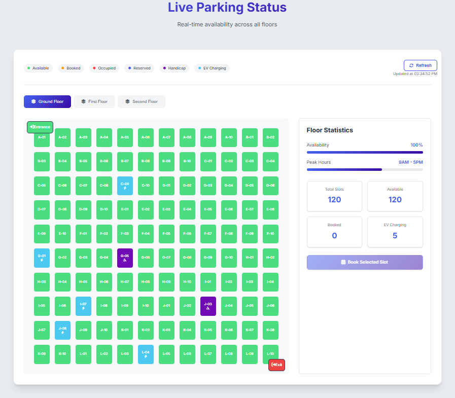
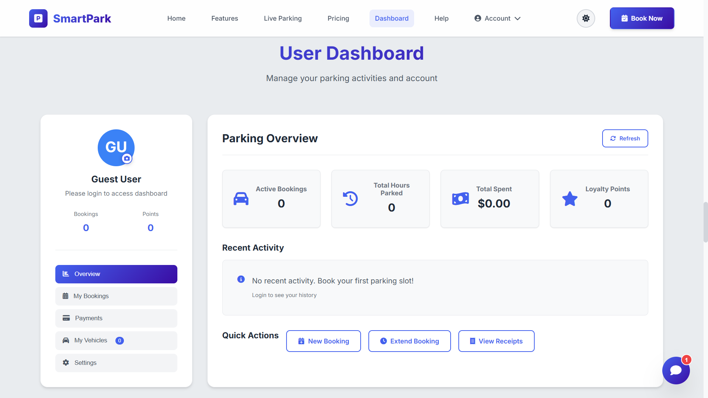
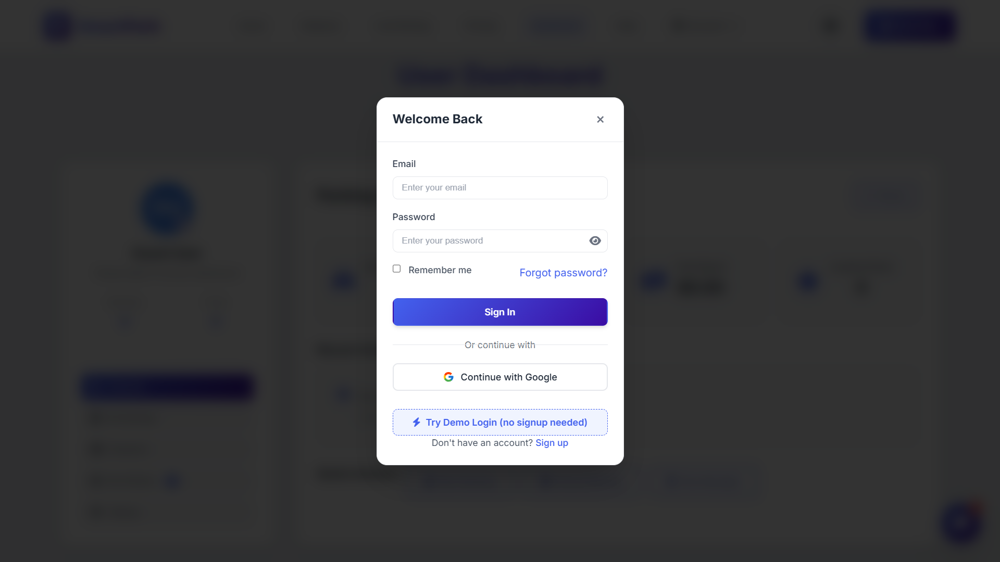

# SmartPark

A real-time parking management system that shows live slot availability across multiple floors and lets you book a spot in seconds — no page reloads, no waiting.

🔵 **Live demo:** [smartpark-hg.web.app](https://smartpark-hg.web.app) — try it instantly with the **"Try Demo Login"** button on the sign-in screen, no signup required.

  

---

## Screenshots

**Homepage — live parking grid**


**Live parking status — real-time slot availability**


**Personal dashboard**


**Login**


---

## Why this exists

Most parking status boards are static — a sign at the entrance, or a map that's already out of date by the time you read it. SmartPark's core idea is that slot availability should update **live**, for everyone looking at it, the instant a spot is taken or freed — not on a timer, not on refresh.

## Engineering highlights

A few things that went into this beyond a basic CRUD app:

- **Real-time sync across every connected client** — slot status writes to Firebase Realtime Database and pushes to every open browser tab instantly, with no polling.
- **Found and fixed a real session-isolation bug** — bookings were leaking across accounts after logout/login because a shared, unfiltered array was overwriting the correctly-scoped per-user data on every page load. Traced it to two separate spots (`initializeApp()` and `logout()`) and fixed both, rather than patching the symptom.
- **Load-tested the database, not just assumed it'd hold up** — wrote a small script that fires 50 concurrent writes at the live database and measures round-trip latency; 100% success rate, zero write conflicts.
- **Write-validated security rules** — rather than requiring login for every write (which would've broken the custom email/password flow), the database rules validate the *shape* of every write instead: only real slot-status updates with the correct fields are accepted, so the app works for every user exactly as before while random garbage/wipe attempts are rejected.
- **Debugged a subtle DOM-timing bug** — the profile avatar looked blank after a refresh because the code was generating the fallback avatar image before the `` element was actually attached to the page, so `document.getElementById` silently found nothing. Fixed by reordering initialization instead of adding a workaround.

## Features

**Guest**
- Browse the live parking grid across multiple floors without logging in
- See real-time slot status: Available, Booked, Occupied, Reserved, Handicap, EV Charging

**Logged in**
- Sign up, log in with email/password, or sign in with Google (Firebase Authentication)
- Book a slot with live duration and cost calculation
- Personal dashboard: active bookings, total hours parked, amount spent, loyalty points, recent activity
- Upload a profile photo (or fall back to an auto-generated initials avatar), synced across the whole UI
- One-click demo login for anyone evaluating the project without wanting to sign up

**Platform**
- Real-time slot sync via Firebase Realtime Database
- In-app live chat and calling widget
- Responsive layout across desktop and mobile
- Social share previews (Open Graph + Twitter cards) so sharing the link looks intentional, not broken

## Tech Stack

- **Frontend:** HTML5, CSS3, JavaScript (no framework)
- **Backend:** Firebase Realtime Database (live slot sync), Firebase Authentication (Google Sign-In)
- **Hosting:** Firebase Hosting

## Project Structure

```
├── index.html                 # Main app page
├── script.js                  # Core app logic (booking, auth, dashboard, parking grid)
├── style.css                  # Main styling
├── firebase-config.js         # Firebase initialization
├── imagescript.js             # Profile photo upload/handling
├── vehicle.js                 # Vehicle-related logic
├── livechat.js / livechat.css # Live chat widget
├── chat-integration.js        # Chat integration logic
├── calling.js                 # In-app calling feature
├── theme.js / theme.css / theme-integration.js  # Theming
├── assets/                    # Demo video, OG share image
└── sounds/                    # Notification sound effects
```

## Try the demo account

The live demo doesn't require signing up — click **"Try Demo Login"** on the login screen, or use these credentials directly:

- **Email:** `demo@smartpark.com`
- **Password:** `demo123`

This is a seeded demo account for evaluation purposes — no real personal data.

## Running Locally

1. Clone this repository
   ```
   git clone https://github.com/himanshugoud/smartpark.git
   ```
2. Open `index.html` in a browser, or serve the folder with any static file server.

> **Note:** live features (Google Sign-In, real-time slot sync) require a connected Firebase project. The `firebase-config.js` in this repo is pre-wired to a live Firebase backend for demo purposes.

> **Known limitation:** email/password accounts are validated against a custom `localStorage`-based system, not real Firebase Authentication — only the Google Sign-In path is backed by actual Firebase Auth. Migrating email/password to Firebase Auth as well is the natural next step for production use.

## License

This project is licensed under the [MIT License](LICENSE).

## Author

**Himanshu Goud**
